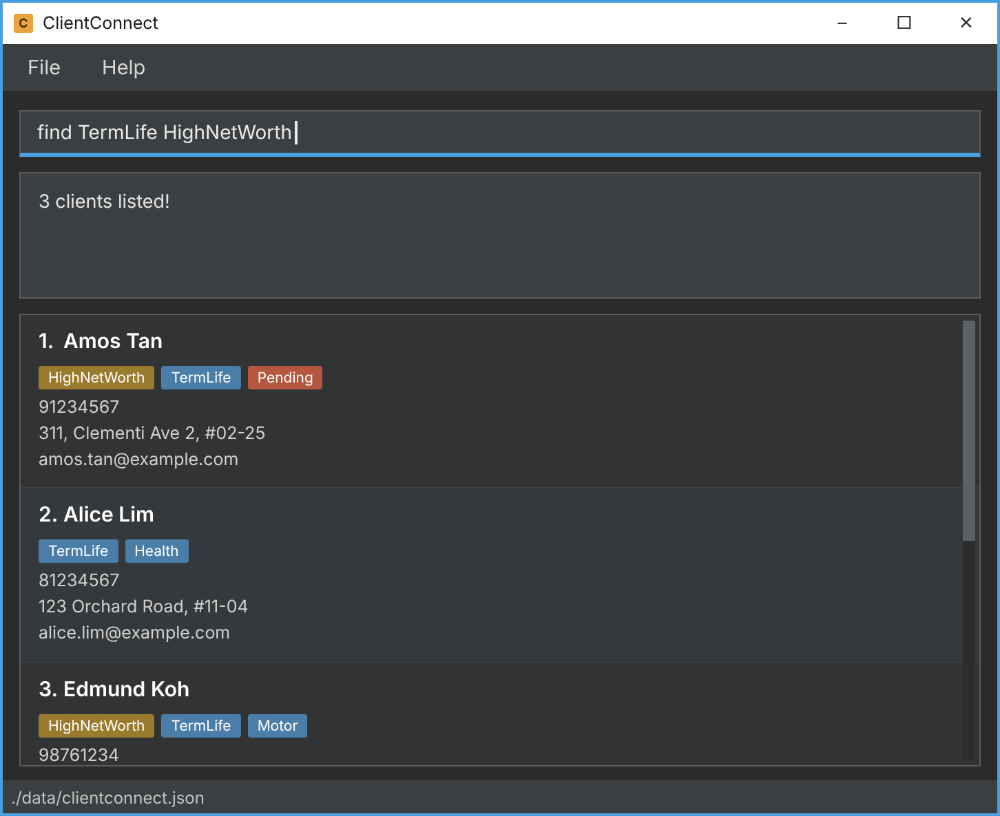

* **ClientConnect** is **an address book application** aim at **insurance agents** who manage extensive client contact lists, large volumes of active leads, or large client portfolios**. 
* **ClientConnect** streamlines contact management for insurance agents by providing _fast, CLI-optimized access_ to rapidly growing client lists. It solves the inefficiency of constant data entry, enabling agents to _seamlessly add, filter, and retrieve critical client details_ to better manage relationships and their extensive portfolios.

* **ClientConnect** allows insurance agents to:
  * _Record_ down client information together with their contact information easily
  * _Find_ cilents based on keyword searches quickly
  * _Remove_ outdated cilent information to reduce clutter

* Why hestitate? Use **ClientConnect** and bring your client connections to another level!
  * To download the latest release of ClientConnect, go to **[ClientConnect Releases Page](https://github.com/AY2627S1-CS2103T-W08-3/tp/releases)**.
  * For the detailed documentation for this project, see the **[ClientConnect Documentation Website](https://ay2627s1-cs2103t-w08-3.github.io/tp/)**.

