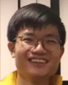
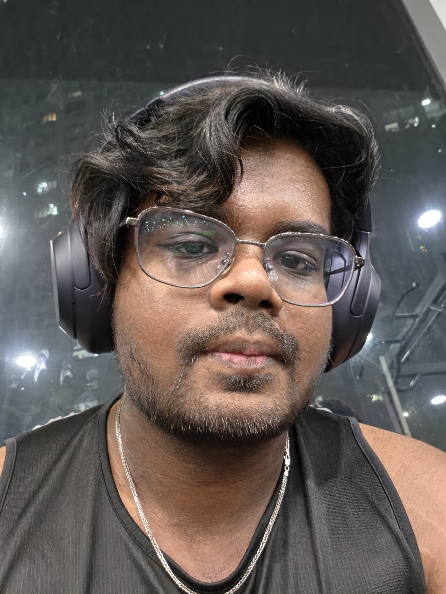
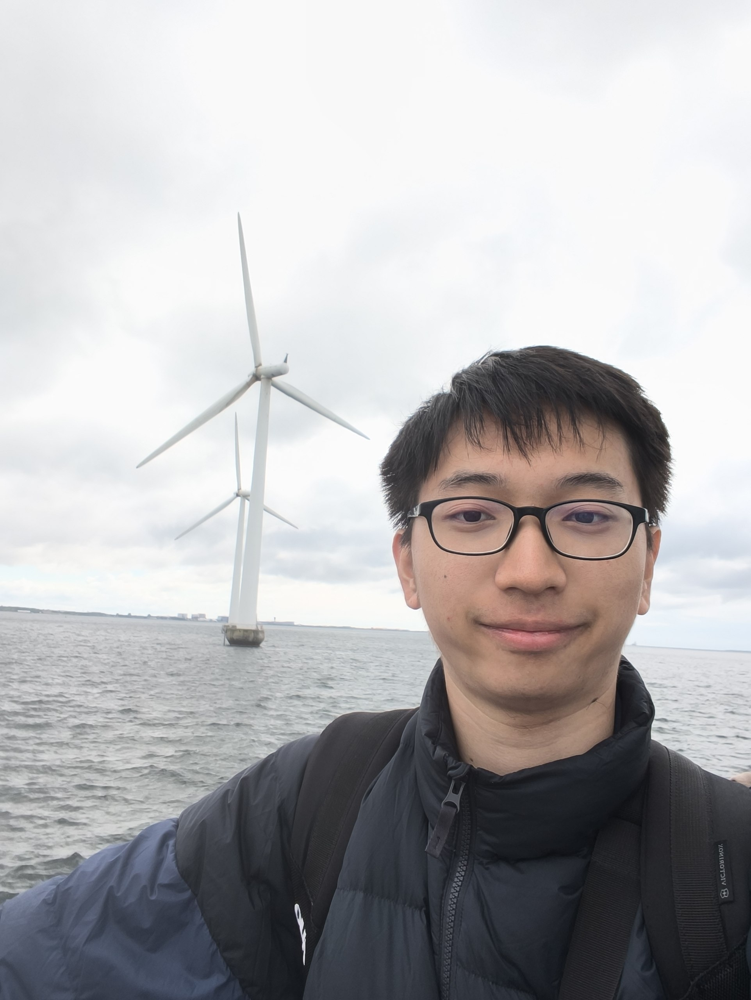
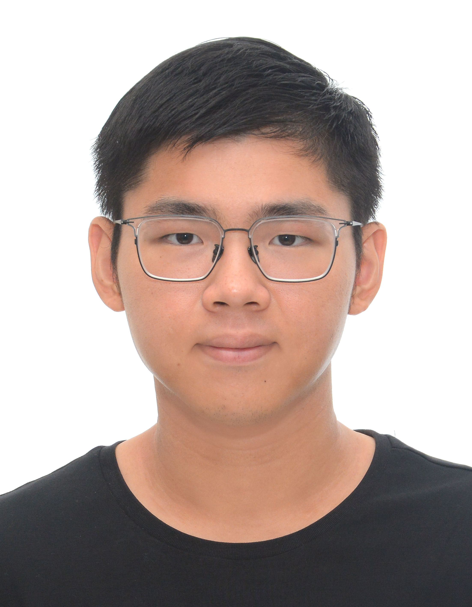
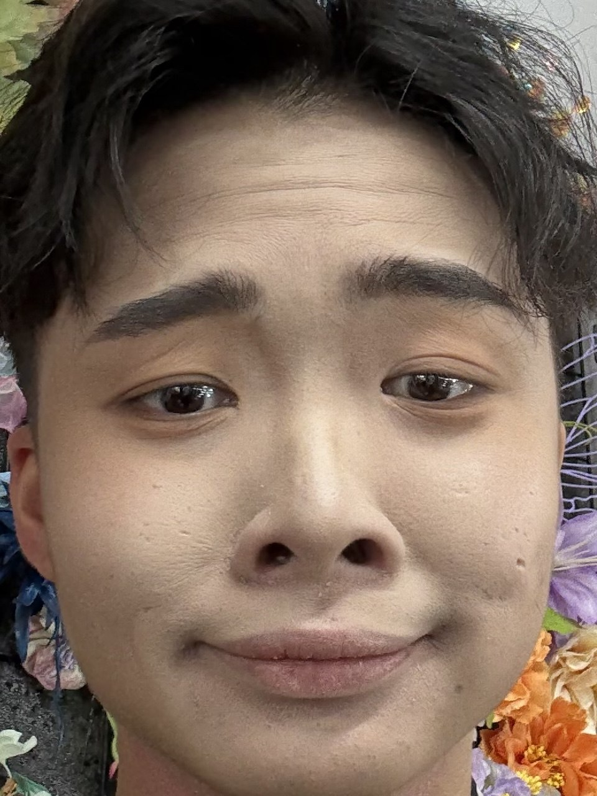

We are a team based in the [School of Computing, National University of Singapore](https://www.comp.nus.edu.sg).

You can reach us at the email `seer[at]comp.nus.edu.sg`

## Project team

### Aw Guangyang Amos

[[github](https://github.com/somawa)]

* Role: Developer
* Responsibilities: UI

### Sakthi

[[github](http://github.com/Sakthi-dev-tech)]

* Role: Developer
* Responsibilities: Backend

### Lin Bo-Ruei

[[github](http://github.com/spoinornus)] 

* Role: Developer, Yapper
* Responsibilities: Yapping, Organising

### Edmund Tan

[[github](https://github.com/EdmundTan37)]
[[portfolio](team/johndoe.md)]

* Role: Developer
* Responsibilities: Dev Ops + Threading

### Koh Yu Jun

[[github](https://github.com/yjenexd)]
[[portfolio](team/johndoe.md)]

* Role: Celery Worker
* Responsibilities: Full Stack
